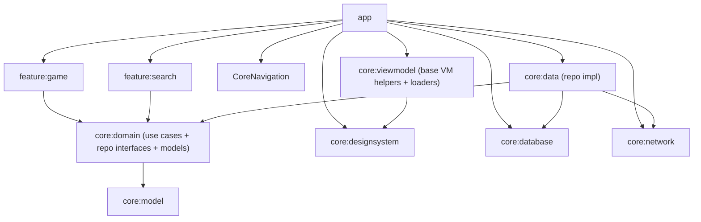
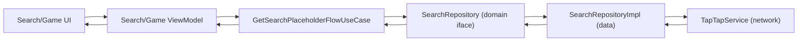
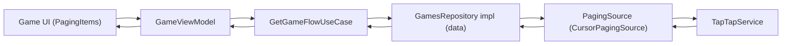

# tutorial_compose

Starter Jetpack Compose app with multi-module + Clean Architecture, Koin DI, and build logic conventions.

## Tech highlights
- Kotlin 2.2, Compose UI, Material3.
- Koin for DI, Kotlinx Serialization, Paging 3 (common + Compose UI in features).
- Modular Gradle setup with convention plugins under `build-logic/`.
- Kotlinx Coroutines, Room (database placeholder), Ktor client for network.

## Module map

## Layering rules (Clean Architecture)
- **Domain**: use cases + repository interfaces + pure models; no Android/Compose/DI.
- **Data**: implements domain repositories, talks to network/database; depends on domain interfaces + model; no UI/navigation.
- **Presentation (feature modules)**: ViewModels/Compose screens; depend on domain use cases + designsystem + navigation + viewmodel helpers.
- **App**: DI wiring (Koin), navigation host, theming; pulls features + core modules.

## Data/flow examples

Search placeholder flow:

Games paging flow:

## Build & run
- Sync/build: `./gradlew :app:assembleDebug`
- Lint/format: KtLint plugin is applied in app; run `./gradlew ktlintCheck`

## Conventions
- Apply module plugins (`compose.taptap.android.*`) from `build-logic/`.
- Feature plugin auto-adds core deps (designsystem, navigation, viewmodel, domain) – add extra deps locally only when needed.
- Keep domain free of Android/Compose; map DTOs to domain models in data layer.
