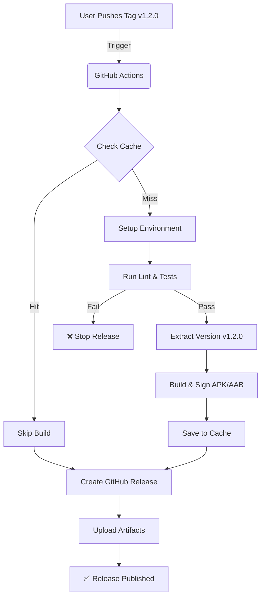

# CI/CD Setup Walkthrough


### 1. Generate a Keystore (if you haven't already)
If you don't have a release keystore, generate one using Android Studio or the command line:
```bash
keytool -genkey -v -keystore keystore_release.jks -keyalg RSA -keysize 2048 -validity 10000 -alias my-key-alias
```

### 2. Encode Keystore to Base64
You need to store your keystore file as a Base64 string to put it in GitHub Secrets.
Run this command in your terminal:
```bash
base64 -i keystore_release.jks | pbcopy
```
(This copies the base64 string to your clipboard on macOS).

### 3. Configure GitHub Secrets
Go to your GitHub Repository -> **Settings** -> **Secrets and variables** -> **Actions** -> **New repository secret**.

Add the following secrets:

| Secret Name | Value |
| :--- | :--- |
| `KEYSTORE_BASE64` | The base64 string you just copied. |
| `KEYSTORE_PASSWORD` | The password for your keystore store. |
| `KEY_ALIAS` | The alias of your key (e.g., `my-key-alias`). |
| `KEY_PASSWORD` | The password for your key alias. |

### 4. Trigger a Build or Release
- **Build Only**: Push a commit to `main`.
- **Create Release**: Push a tag starting with `v` (e.g., `v1.0.0`).
    ```bash
    git tag v1.0.0
    git push origin v1.0.0
    ```

## Verification
- **Push to main**: The workflow will run, check cache, and upload artifacts to the workflow run.
- **Push tag**: The workflow will run, check cache, and **create a GitHub Release** with the APK/AAB and auto-generated notes.

## 📘 Detailed Release Flow

Here is exactly what happens when you trigger a release:



### Step-by-Step Explanation
1.  **Trigger**: You push a tag (e.g., `v1.2.0`).
2.  **Quality Check**:
    - The system runs `./gradlew lintRelease` to check for code issues.
    - It runs `./gradlew testReleaseUnitTest` to verify logic.
    - **Safety**: If any of these fail, the release is **cancelled** immediately.
3.  **Smart Caching**:
    - It calculates a hash of your source code.
    - If you already built this exact code before, it skips the build to save time.
4.  **Versioning**:
    - It extracts `1.2.0` from your tag `v1.2.0`.
    - It sets `versionName` to `1.2.0`.
    - It sets `versionCode` to the GitHub Run Number (e.g., `42`).
5.  **Build & Sign**:
    - It builds the Android App Bundle (`.aab`) and APK (`.apk`).
    - It signs them using the Keystore from your Secrets.
6.  **Publish**:
    - It creates a new **Release** in your GitHub repository.
    - It uploads the signed APK and Bundle.
    - It auto-generates release notes from your commit history.
